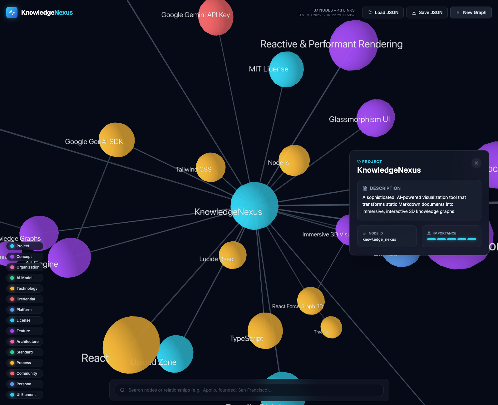

# KnowledgeNexus


> **Uncover the hidden structure of Markdown documents with AI-powered, 3D knowledge graphs.**



## Overview

KnowledgeNexus ingests Markdown or plain-text notes, asks Google’s **Gemini 3 Flash Preview** model (with Thinking Mode enabled) to extract entities and relationships, and renders the results as an immersive force-directed graph. The experience is built with React 19, Vite, and TypeScript, combines Tailwind-driven UI polish with Lucide icons, and relies on a lightweight utility layer to normalize graph data for reliable import/export flows.

## Feature Highlights

- **Gemini-powered extraction** – `services/geminiService.ts` leverages **Gemini 3's "High" Thinking Mode** to perform deep, sophisticated analysis. It targets 50-100+ nodes per extract and maps the intellectual structure of the domain, not just surface entities.
- **Zero-friction ingestion** – `components/UploadZone.tsx` accepts `.md`, `.markdown`, and `.txt`, validates file types, and streams content to the extractor while animating feedback.
- **Immersive 3D graph** – `components/Graph3D.tsx` wraps `react-force-graph-3d`, autogenerates a color legend per entity type, keeps sprite labels facing the camera, and zooms any clicked node into focus.
- **Contextual insights** – `components/Sidebar.tsx` reveals descriptions, node IDs, and importance bars for selected nodes, while `App.tsx` tracks stats, file names, and state transitions (`IDLE → PARSING → VISUALIZING`).
- **Search & highlighting** – a bottom command palette filters both nodes and relationships (min two characters) and highlights matching links via `buildLinkKey`.
- **JSON import/export** – load prior graphs through the hidden JSON picker or export normalized snapshots via `createGraphExportSnapshot`, complete with timestamped filenames.
- **AI Graph Reasoning Chat** – A persistent, draggable chat window (`components/AnalysisChat.tsx`) that lets you converse with Gemini 3 Flash about the graph's structure, themes, and hidden patterns.
- **Operational feedback** – glassmorphic toasts, node/link counters, and duration measurements tell you when Gemini succeeds, when a graph is invalid, or when to retry.

## UI Tour

- **Navigation bar** – quick stats, “Load JSON”, “Save JSON”, and “New Graph” controls stay reachable during visualization.
- **Upload Zone** – cinematic drop area for Markdown/TXT with drag indicators, inline validation, and loading spinner.
- **Visualization surface** – 3D canvas with detailed ambient styling, nav hints, and a dynamic legend of entity types.
- **Query palette** – persistent search form that lists matching nodes or relationship triplets and focuses the camera when a result is picked.
- **AI Chat** – floating, resizable window for natural language Q&A with the graph model.
- **Insights sidebar** – slides in when a node is selected, displaying description, ID, category, and importance meter.

## Architecture

1. **Ingestion (`UploadZone`)** – validates the file type, reads text via `FileReader`, and passes it plus the filename to `App.tsx`.
2. **Extraction (`extractGraphFromMarkdown`)** – sends the text to Gemini with system instructions describing a "Visionary Knowledge Graph Architect" persona, unlimited node count goals, "Reasoning: HIGH" configuration, and a strict `responseSchema`.
3. **Normalization (`utils/graph.ts`)** – converts Gemini’s `importance` to `val`, strips invalid links, and keeps helper utilities (`buildLinkKey`, `createGraphExportSnapshot`, `isGraphDataShape`) centralized.
4. **Visualization (`Graph3D`)** – computes `typeColorMap`, tunes d3 forces, builds `SpriteText` labels, and keeps highlight state in sync with search results.
5. **Stateful UI (`App.tsx`)** – orchestrates `AppState`, toast notifications, stats, query filtering, node selection, and reset flows, then hands node metadata to `Sidebar`.

## Tech Stack

- React 19 + Vite + TypeScript 5.8 (strict JSX + hooks)
- Google GenAI SDK (`@google/genai`) targeting `gemini-3-flash-preview`
- Google GenAI SDK (`@google/genai`) targeting `gemini-3-flash-preview`
- `react-markdown` for rich text chat responses
- `react-force-graph-3d`, `three`, and `three-spritetext` for rendering
- Tailwind CSS via CDN plus Lucide React icons for UI polish
- Local utilities (`utils/graph.ts`, `types.ts`) that share types across components and services

## Getting Started

### Prerequisites

- Node.js 18+ and npm 10+
- A Google Gemini API key (create at [Google AI Studio](https://aistudio.google.com/))
- Modern GPU-friendly browser for WebGL visualization

### Install & bootstrap

```bash
git clone https://github.com/yourusername/knowledge-nexus.git
cd knowledge-nexus
npm install
```

### Configure environment

Create `.env.local` (or `.env`) in the project root and add your Gemini credential:

```bash
API_KEY=your_google_gemini_api_key
```

> `services/geminiService.ts` reads `process.env.API_KEY`. Never commit this key; rotate it regularly and prefer per-device environment files.

### Available scripts

| Command | Description |
| --- | --- |
| `npm run dev` | Launches Vite at `http://localhost:5173` with hot reload. |
| `npm run build` | Produces the optimized `dist/` bundle. |
| `npm run preview` | Serves the built bundle to mimic a production deploy. |

## Usage

1. Run `npm run dev` and open the printed localhost URL.
2. Drop or select a Markdown/TXT file inside the Upload Zone. Sample files such as `test.md-*.json` and `example.json` in the repo are handy for experimentation.
3. Watch `AppState` change from **IDLE** to **PARSING** as the Gemini request runs. Errors raise a red toast and temporarily show the error card.
4. Once **VISUALIZING**, rotate (left drag), pan (right drag), and zoom (scroll). Click nodes to focus them, open the sidebar, and expose their metadata.
5. Use the bottom search palette to highlight nodes or relationships. Press “Clear” to reset and regain organic graph motion.
6. Click **AI Chat** to open the reasoning assistant. Drag the header to move it, resize from the bottom-right, and ask questions about your data. The history persists while the session is open.
7. Use **Load JSON** to rehydrate a saved graph, **Save JSON** to export the normalized structure, or **New Graph** to wipe the scene and upload another file.

## Graph JSON format

All graph interactions share the `GraphData` shape defined in `types.ts`:

```json
{
  "nodes": [
    {
      "id": "knowledge_nexus",
      "name": "KnowledgeNexus",
      "type": "Project",
      "description": "AI visualization tool",
      "val": 5
    }
  ],
  "links": [
    {
      "source": "knowledge_nexus",
      "target": "react",
      "relationship": "built_with"
    }
  ]
}
```

When importing JSON, `isGraphDataShape` validates that every node has `id`, `name`, `type`, and `description`, and each link references valid node IDs. Exports created through the UI already respect this format.

## Testing & quality

- Target harness: **Vitest + React Testing Library**. Place specs next to components (e.g., `Graph3D.test.tsx`) or inside local `__tests__/` folders.
- Recommended command (after adding Vitest): `npx vitest run --coverage`.
- Manual verification before a PR: `npm run dev` for smoke testing, `npm run build` to ensure the bundle succeeds, and `npm run preview` to check deployment-like behavior.

## Project structure

```
.
├── App.tsx                # Application shell + state orchestration
├── components/
│   ├── Graph3D.tsx        # 3D renderer, highlighting, camera focus
│   ├── Sidebar.tsx        # Node insights panel
│   ├── AnalysisChat.tsx   # Floating AI reasoning interface
│   └── UploadZone.tsx     # Drag-and-drop ingestion surface
├── services/geminiService.ts # Gemini extraction helper
├── utils/graph.ts         # Normalization, serialization, helper guards
├── types.ts               # Shared GraphData + AppState types
├── screenshot.png         # Latest UI capture (see top of README)
└── index.(html|tsx)       # Vite entry + Tailwind CDN hook
```

## Contributing

Contributions are welcome! Use Conventional Commit messages (`feat:`, `fix:`, `chore:`), open focused pull requests that link to an issue, and include verification notes (`npm run dev`, `npm run build`, `npx vitest run --coverage`). Please respect the API key policy, redact Gemini payloads in logs, and keep shared types inside `types.ts` before touching UI state.

## License

KnowledgeNexus is distributed under the [MIT License](./LICENSE).
